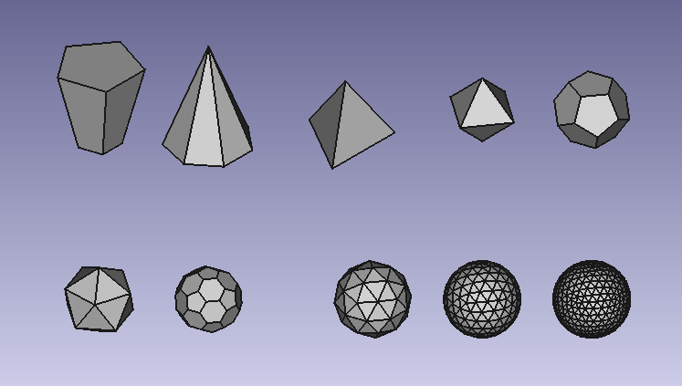

# Pyramids-and-Polyhedrons
FreeCad Workbench for generating
pyramids and polyhedrons:
- tetrahedron
- hexahedron
- octahedron
- dodecahedron
- icosahedron
- truncated icosahedron (football)
- geodesic spheres (level 1 to 10)

All these parts are fully scalable and can be adjusted at all time.

# How to use:
- Activate the shape you want by clicking on the icon in the workbench.
- Activate it by clicking on the label in the Model.
- Then adjust the sizes, as with classic Parts.

# Tutorials on YouTube:
- [Pyramids use and possibilities](https://youtu.be/H8IgmzpMpSg) 
- [More advanced, build a model of a geodesic dome](https://youtu.be/FsYHYnVcVvI) 

# Install using the addon manager
In FREECAD go to the Main Menu/Tools/Addon Manager
- Select the tab Workbenches
- Select 'Pyramids-and-Polyhedrons' and click "Install"

# How to install the workbench manually 
(if not available in FreeCAD-addons)
- Find the Macro folder via FreeCadMenu/Edit/Preferences/Macro ...
- Go to the 'Mod' folder, next to the 'Macro' folder
- download a copy of this repository and put it in the Mod folder
- IMPORTANT! Rename the folder to "Pyramids-and-Polyhedrons" (remove "-master")
- (re)start FreeCAD
- The workbench 'Pyramids-and-Polyhedrons' is now in the list of workbenches.

# Alternative solution
Macro Pyramids and macro Polyhedrons
The addon manager does contain the same functions as macros.
So if you have trouble installing the workbench, this is a suitable alternative.
